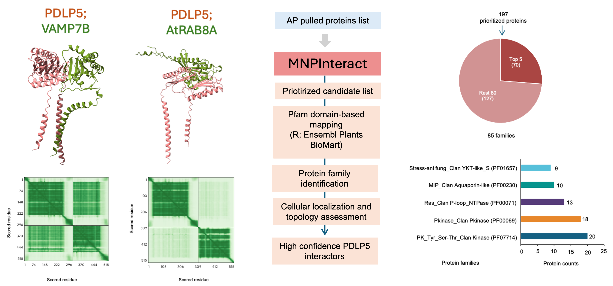

# MNPInteract

**Complete post-AlphaPulldown pipeline for identifying high-confidence membrane protein interactors.**

MNPInteract takes the raw scoring output of [AlphaPulldown](https://github.com/KosinskiLab/AlphaPulldown) and runs a three-step program entirely on an HPC cluster, producing a final ranked list of high-confidence interactors.

<p align="center">
  
</p>

## Overview

MNPInteract runs in **three steps**, all on HPC:

```
STEP 1 — Login node (internet access, no GPU needed)
    MNPInteract --S1

STEP 2 — SLURM GPU job
    MNPInteract --S2-4

STEP 3 — Login node (no GPU needed)
    MNPInteract --S5
```

| Step | Stage(s) | Where | What it does |
|------|----------|-------|-------------|
| 1 | Stage 1 | Login node | Filters AlphaPulldown candidates by score cutoffs; adds gene symbol, PFAM domain, and GO Cellular Component terms via Ensembl BioMart and InterPro |
| 2 | Stages 2–4 | SLURM GPU job | Runs DeepTMHMM topology prediction; detects atom-level residue contacts; assigns LIKELY/UNLIKELY verdict per interaction |
| 3 | Stage 5 | Login node | Merges all results; applies GO term and score filters to generate the final high-confidence interactor list |

> **Why split across three steps?**
> Stage 1 queries Ensembl BioMart and InterPro over the internet — Nova login nodes have internet access but compute nodes do not. Stages 2–4 require a GPU and the AlphaPulldown prediction files on Lustre. Stage 5 is lightweight and runs anywhere. All three steps use the same `conf.txt` and write to the same output directory.

---

## Contents

- [Prerequisites](#prerequisites)
- [Installation](#installation)
- [Input files](#input-files)
- [Configuration: conf.txt](#configuration-conftxt)
- [Running MNPInteract](#running-mnpinteract)
- [Output files](#output-files)
- [Command-line reference](#command-line-reference)
- [Troubleshooting](#troubleshooting)
- [Citation](#citation)

---

## Prerequisites

### 1. AlphaPulldown output

You must have already run [AlphaPulldown](https://github.com/KosinskiLab/AlphaPulldown). You need:

- **`predictions_with_good_interpae.csv`** — the AlphaPulldown scoring output (input for Step 1)
- A directory of **prediction sub-folders** on Lustre, each containing:
  - `ranked_0.pdb`
  - `result_model_*.pkl` or `result_model_*.pkl.gz`
  - `ranking_debug.json`

### 2. DeepTMHMM Academic License

1. Request and download from: https://services.healthtech.dtu.dk/services/DeepTMHMM-1.0/
2. On Nova: `unzip DeepTMHMM-Academic-License-v1.0.zip`
3. Create a dedicated Python virtual environment and install all dependencies:

```bash
module load python/3.8.18-4j5jvxi
python -m venv deeptmhmm-venv
source /path/to/your/alphapulldown/deeptmhmm-venv/bin/activate

# Step 1 — install GPU-enabled PyTorch first
pip install torch==1.13.1+cu117 \
    --extra-index-url https://download.pytorch.org/whl/cu117

# Step 2 — install all remaining DeepTMHMM dependencies
pip install -r /path/to/your/alphapulldown/MNPInteract/deeptmhmm_requirements.txt
```

> DeepTMHMM requires a GPU (tested with NVIDIA A100 on Nova).
> **Important:** Do not run `pip install -r` on the DeepTMHMM folder's own `requirements.txt` — it lists `torch==1.5.0+cu92` which is outdated and might break GPU support on the GPU. Use the `deeptmhmm_requirements.txt` file from MNPInteract instead.

### 3. Python version

Python ≥ 3.8. Tested with Python 3.8.18.

---

## Installation

### Step 1 — Clone the repository on Nova

```bash
cd /path/to/your/directory/
git clone https://github.com/YOUR_USERNAME/MNPInteract.git
```

### Step 2 — Activate the DeepTMHMM virtual environment

MNPInteract must be installed into the **same virtual environment as DeepTMHMM** so that the `MNPInteract` command is available when the venv is active:

```bash
source /path/to/your/alphapulldown/deeptmhmm-venv/bin/activate
```

### Step 3 — Install MNPInteract

```bash
cd MNPInteract/
pip install -r requirements.txt
pip install -e .
```

The `-e` flag (editable install) means `git pull` updates take effect immediately.

### Step 4 — Verify

```bash
MNPInteract --help
```

You should see the help message listing `--S1`, `--S2-4`, `--S5`.

### Step 5 — Create your conf.txt

Move to your working directory and generate the template:

```bash
cd /path/to/your/alphapulldown
MNPInteract --print-template > conf.txt
```

Open and fill in your actual paths:

```bash
nano conf.txt
```

Replace all `<your-lab>` and `<username>` placeholders with your real values.
Save and exit: `Ctrl+X` then `Y` then `Enter`.

Verify it looks correct:

```bash
cat conf.txt
```

---

## Input files

### `predictions_with_good_interpae.csv` (required — Step 1)

The scoring output from AlphaPulldown. Must contain:

| Column | Description |
|--------|-------------|
| `jobs` | Prediction folder name (e.g. `PDLP5_and_AT1G09610`) |
| `iptm` | Interface predicted TM score |
| `mpDockQ.pDockQ` | DockQ score |
| `pi_score` | Interface score |

Set the path to this file in `conf.txt` under `Path_interpae_csv`.

### `conf.txt` (required — all steps)

The configuration file. See [Configuration: conf.txt](#configuration-conftxt).

---

## Configuration: conf.txt

Copy the template and fill in your Nova paths:

```bash
MNPInteract --print-template > conf.txt
nano conf.txt
```

Full annotated reference:

```
# MNPInteract configuration file
# All paths must be absolute paths on the Nova Lustre filesystem.

# ── INPUT ──────────────────────────────────────────────────────────────────────

# REQUIRED for Step 1 — AlphaPulldown scoring output
Path_interpae_csv     : /path/to/your/predictions_with_good_interpae.csv

# REQUIRED for Step 2 — directory of AlphaPulldown prediction sub-folders
Path_PDB_dir          : /path/to/your/results from AlphaPulldown

# OPTIONAL — PDLP5 FASTA. Leave blank to use the built-in AT2G33330 sequence.
Path_PDLP5_fasta      :

# REQUIRED — all output files go here (created automatically if absent)
Path_output           : /path/to/your/alphaPulldown/MNPInteract_output

# ── DEEPTMHMM (Step 2) ─────────────────────────────────────────────────────────

# Path to the unpacked DeepTMHMM directory (must directly contain predict.py)
Path_DeepTMHMM_dir    : /path/to/your/alphapulldown/DeepTMHMM-Academic-License-v1.0

# Python binary inside the DeepTMHMM virtual environment
Path_DeepTMHMM_venv   : /path/to/your/alphapulldown/deeptmhmm-venv/bin/python

# ── PARALLELISM ────────────────────────────────────────────────────────────────

Max_workers_gpu       : 4    # keep at 4 to avoid GPU out-of-memory
Max_workers_cpu       : 16   # match to --ntasks in your SLURM script

# ── CONTACT CUTOFFS ────────────────────────────────────────────────────────────

Distance_cutoff       : 6.0   # Angstroms
PAE_cutoff            : 25.0

# ── SCORE CUTOFFS (Step 1 — OR logic, rows passing any cutoff are kept) ────────

IPTM_cutoff           : 0.30
DockQ_cutoff          : 0.23
Piscore_cutoff        : 0
```

---

## Running MNPInteract

### Preparation

Log in to HPC and activate the DeepTMHMM virtual environment. Then move to the directory containing your `conf.txt` — all steps must be run from this directory:

```bash
ssh <username>@nova.its.iastate.edu
source /path/to/your/alphapulldown/deeptmhmm-venv/bin/activate
cd /path/to/your/alphaPulldown
```

---

### Step 1 — Score filtering and annotation (login node)

Run directly on the login node — no SLURM job needed. This step queries the internet (BioMart, InterPro) and takes a few minutes:

```bash
MNPInteract --S1
```

When complete you will see:

```
  Stage 1 complete.
  Output: .../MNPInteract_output/Prioritized candidate list_with_PFAM_GO_annotations.csv

  NEXT STEP:
  Submit a SLURM GPU job and run:
    MNPInteract --S2-4
```

---

### Step 2 — DeepTMHMM, interface detection, topology (SLURM GPU job)

Write a SLURM script (name it e.g. `run_stage24.sh`):

```bash
#!/bin/bash
#SBATCH --job-name=MNPInteract_24
#SBATCH --partition=nova
#SBATCH --nodes=1
#SBATCH --ntasks=16
#SBATCH --cpus-per-task=1
#SBATCH --gres=gpu:a100:1
#SBATCH --mem=128G
#SBATCH --time=2-00:00:00
#SBATCH --hint=nomultithread
#SBATCH --mail-type=BEGIN,END,FAIL
#SBATCH --mail-user=<your-email>@iastate.edu
#SBATCH --output=MNPInteract_24-%j.log
#SBATCH --error=MNPInteract_24-%j.err

module load python/3.8.18-4j5jvxi
source /path/to/your/alphapulldown/deeptmhmm-venv/bin/activate

cd /path/to/your/alphaPulldown

MNPInteract --S2-4
```

Submit:

```bash
sbatch run_stage24.sh
squeue -u <your_username>
tail -f MNPInteract_24-<jobid>.log
```

When complete you will see:

```
  Stages 2–4 complete.
  Output: .../MNPInteract_output/topology_contact_report.csv

  NEXT STEP:
  On the login node run:
    MNPInteract --S5
```

---

### Step 3 — Final high-confidence interactor list (login node)

Run on the login node — takes less than a minute:

```bash
MNPInteract --S5
```

When complete:

```
  Stage 5 complete.
  Final output : .../MNPInteract_output/Final_High_Confidence_Interactors_only.csv
  Interactors  : <N>
```

---

### Resuming a partial run

MNPInteract automatically skips already-completed folders in Stages 2–4. If a SLURM job times out, simply resubmit:

```bash
sbatch run_stage24.sh
```

Stage 1 also skips processing if the annotated CSV already exists in `Path_output`. To force a re-run, delete or rename the existing annotated CSV before running `--S1` again.

---

## Output files

All written to `Path_output/`.

### Step 1 outputs

| File | Description |
|------|-------------|
| `Prioritized candidate list.csv` | Score-filtered candidates before annotation |
| `Prioritized candidate list_with_PFAM_GO_annotations.csv` | With gene symbol, PFAM, GO CC terms — input for Step 2 |
| `pfam_summary_with_ATids_and_annotations.csv` | PFAM domain frequency summary with InterPro names |

### Step 2 outputs

| File | Description |
|------|-------------|
| `deeptmhmm_nova_report.csv` | DeepTMHMM run status per folder |
| `deeptmhmm_outside_inside_report.csv` | PDLP5 outside and partner inside residue ranges |
| `interface_processing_report_atom.csv` | Interface detection status and pair counts per folder |
| `topology_contact_report.csv` | LIKELY / UNLIKELY verdict — input for Step 3 |

### Step 3 outputs — final results

| File | Description |
|------|-------------|
| `Prioritized_candidates_with_high_confidence.csv` | Full merged dataset with all annotations and verdicts |
| `high_confidence_summary.csv` | TRUE / FALSE counts |
| `High_Confidence_Interactors_only.csv` | LIKELY verdict + compatible GO term |
| **`Final_High_Confidence_Interactors_only.csv`** | **Primary output — LIKELY + GO filter + iptm ≥ 0.30 + mpDockQ ≥ 0.23** |

Per-folder outputs inside each AlphaPulldown prediction sub-directory:

| File | Description |
|------|-------------|
| `input.fasta` | Two-entry FASTA used as DeepTMHMM input |
| `result/deeptmhmm_results.md` | Raw DeepTMHMM topology output |
| `BC_res_int_atom.csv` | All contact residue pairs with distances and PAE values |
| `BC_res_int_atom_unique_pairs.csv` | Deduplicated contact pairs |
| `BC_res_int_atom_pymol_selections.txt` | PyMOL selection strings |

### Interpreting the final output

A protein is classified as a high-confidence interactor in `Final_High_Confidence_Interactors_only.csv` if it satisfies **all** of:

1. `interaction_verdict` = `LIKELY` — no topologically impossible contacts detected
2. `go_cc_term` is empty **or** contains a PD-compatible term (plasmodesma, membrane, plasma membrane, cell wall, apoplast, extracellular region)
3. `iptm` ≥ 0.30
4. `mpDockQ.pDockQ` ≥ 0.23

---

## Command-line reference

```
MNPInteract --S1 | --S2-4 | --S5 [OPTIONS]

Required:
  --S1     Score filtering + PFAM/GO annotation  (login node)
  --S2-4   DeepTMHMM + interface + topology       (SLURM GPU job)
  --S5     Final high-confidence interactors      (login node)

Options:
  --conf PATH       Path to conf.txt (default: ./conf.txt)
  --print-template  Print a conf.txt template to stdout and exit
  -h, --help        Show this help message and exit
```

---

## Troubleshooting

**`conf.txt not found`**
Run MNPInteract from the directory containing `conf.txt`, or use `--conf /full/path/to/conf.txt`.

**`pybiomart` not installed — annotation skipped**
Install with `pip install pybiomart`. The pipeline continues without it but SYMBOL, PFAM, and GO columns will be empty.

**`BioMart connection failed` during Stage 1**
Make sure you are on the Nova **login node**, not a compute node. Compute nodes have no outbound internet access.

**`Stage 1 output not found` when running Stage 2-4**
Stage 1 must complete successfully before submitting the SLURM job. Check `Path_output` in `conf.txt` points to the same directory in both steps.

**`predict.py not found`**
`Path_DeepTMHMM_dir` must point to the directory that **directly contains** `predict.py`.

**`PAE shape mismatch`**
The `.pdb` and `.pkl` files are from different AlphaPulldown runs. The affected folder is skipped automatically.

**`ModuleNotFoundError: No module named 'tqdm'` or `esm` or `h5py`**
You missed installing the DeepTMHMM dependencies. Run:
```bash
source /path/to/your/alphapulldown/deeptmhmm-venv/bin/activate
pip install -r /path/to/your/alphapulldown/MNPInteract/deeptmhmm_requirements.txt
```
Then resubmit the job.

**`CUDA not available`**
Ensure your SLURM script requests a GPU (`--gres=gpu:a100:1`) and that GPU-enabled PyTorch is installed in the DeepTMHMM venv.

**SLURM job times out**
Increase `--time`. MNPInteract resumes automatically — resubmit the same job.

**A gene ID shows `[FAIL]` during sequence fetching**
This means the UniProt API dropped the connection temporarily for that gene. The pipeline continues with all other proteins — only that one is skipped. To recover the missing gene, simply rerun Stage 2-4 after the job finishes:
```bash
sbatch run_S24.sh
```
MNPInteract automatically skips all folders that were already successfully processed and only retries the ones that were missed. You do not need to rerun Stage 1 or Stage 5.

**Some folders are missing from the final output**
If a folder was skipped because its sequence could not be fetched, rerun Stage 2-4:
```bash
sbatch run_S24.sh
```
Then rerun Stage 5 to regenerate the final output with the recovered proteins:
```bash
MNPInteract --S5
```

---

## Package structure

```
MNPInteract/
├── MNPInteract/
│   ├── __init__.py        — package marker
│   ├── MNPInteract.py     — CLI entry point, orchestrates all stages
│   ├── Config.py          — stage-aware conf.txt reader and validator
│   ├── Annotate.py        — Stage 1: score filter + BioMart/PFAM/GO annotation
│   ├── Proteins.py        — protein list loading, UniProt fetching, FASTA writing
│   ├── DeepTMHMM.py       — Stage 2: runs predict.py, parses topology
│   ├── Interface.py       — Stage 3: parallel atom-level contact detection
│   ├── Topology.py        — Stage 4: LIKELY / UNLIKELY verdict assignment
│   └── Confidence.py      — Stage 5: final high-confidence interactor generation
├── requirements.txt
├── setup.py
├── conf.txt               — annotated configuration template
└── README.md
```

---

## Citation

If you use MNPInteract in your research, please cite:

- **MNPInteract**: Islam S. et al. (2026) bioRxiv. https://doi.org/....

---

## License

[GPL-3.0](LICENSE) — DeepTMHMM has its own Academic License; obtain it before use.
